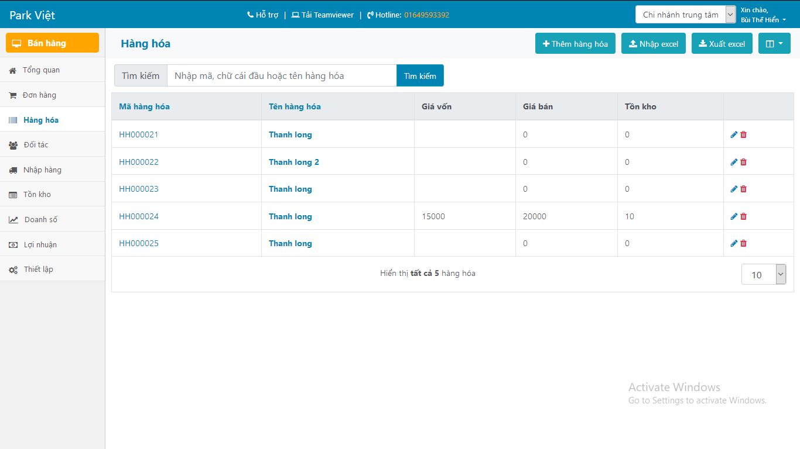
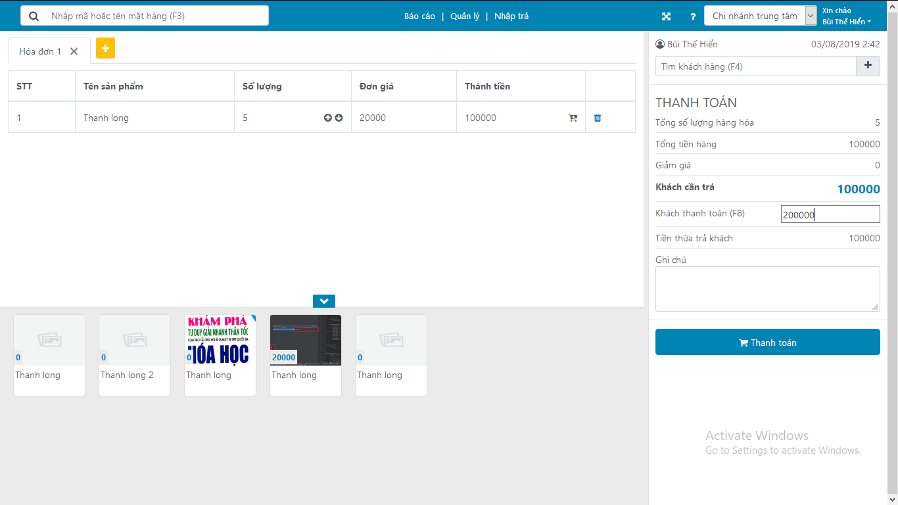

# Giới thiệu
Park Việt là phần mềm quản lý bán hàng, kinh doanh sử dụng tại các điểm cửa hàng nhỏ, các đơn vị kinh doanh hộ gia đình, siêu thị hoặc trung tâm thương mại.

Ưu điểm của Part Việt so với các phần mềm bán hàng truyền thống
- Phần mềm chạy trên nền web, lưu trữ đám mây, không cần phải cài đặt, chỉ cần khởi tạo và sử dụng
- Phần mềm được hỗ lưu trữ bản sao, cho phép khôi phục lại dữ liệu khi có lỗi xảy ra.
- Cho phép người dùng sử dụng trên các thiết bị máy tính bảng, điện thoại từ xa để quản lý tình hình kinh doanh một cách dễ dàng. 

Ưu điểm của Part Việt so với các phần mềm bán hàng nền web khác
- Sử dụng học máy AI, deep learning để phân tích dữ liệu người dùng, đưa ra thói quen gợi ý trong quá trình bán hàng hoặc tiếp thị lại.
- Cho phép khách hàng có thể đặt hàng trước qua mạng.    
- Được tư vấn và hỗ trợ tận nơi, bổ sung các chức năng cần thiết cho từng mục đích của mỗi cửa hàng. Phù hợp với cá nhân, hộ gia đình kinh doanh nhỏ lẻ.  
- Miễn phí & Mã nguồn mở

# Tiến độ dự án
- Hoàn thành cơ bản phần quản lý cho chủ cửa hàng
- Đang hoàn thiện chức năng bán hàng

# Chức năng đã hoạt động
- Quản lý sản phẩm
- Quản lý đối tác: Khách hàng & Nhà cung cấp
- Quản lý nhập hàng
- Quảng lý đặt hàng trước khi nhập từ nhà cung cấp
- Quản lý bán hàng: Thanh toán và lập hóa đơn mua hàng
- Quản lý người dùng trong cửa hàng

# Chức năng cần bổ sung
- In hóa đơn & Tùy chỉnh mẫu hóa đơn
- Cho phép làm việc Offline ngay cả khi mất mạng. Đồng bộ dữ liệu khi có mạng trở lại
- Cho phép lưu phiên làm việc và phục hồi khi có sự cố mất điện
- Cho phép thanh toán nhiều hóa đơn
- Cho phép in lại hóa đơn đã thanh toán
- Sao lưu dữ liệu hàng ngày. Tối đa lên đến 7 ngày. Nhằm ngăn chặn mất mát dữ liệu.
- Cho phép thanh toán trên máy tính bảng
- Cho phép quản lý trên điện thoại, máy tính bảng
- Cho phép đồng bộ dữ liệu từ trên trang TMĐT khác: Tiki, Shopee, Lazada, Sendo
- Tạo trang web bán hàng
- Kết nối với Facebook Fanpage để quản lý và thực thi QC, chiến dịch Marketing...
- Bán hàng trên facebook, sàn TMĐT, website khác
- Hỗ trợ nhiều chi nhánh
- Chức năng quản lý nhân sự - lương nhân viên
- Chức năng quản lý quan hệ khách hàng (CRM)
- Quản lý kho
- Quản lý hàng hóa
- Quản lý sản xuất
- Quản lý thuế
- Quản lý tài sản cố định
- Quản lý tài chính - kế toán
- Báo cáo quản trị
- Quản lý và bán hàng đa kênh
- Quản lý khuyến mại
- Quản lý nhà cung cấp	
- Quản lý chuỗi cửa hàng	
- Quản lý giao hàng	
- Tích hợp đối tác vận chuyển
- Quản lý công nợ
- Chăm sóc khách hàng

# Tìm bạn hợp tác & kinh doanh
Một mình làm thì không xuể vậy nên các bạn có thể cùng tham gia phát triển dự án với mình nhé,

Phần mềm đương nhiên vẫn là miễn phí nhé mọi người. Ngoài ra, mình muốn hợp tác để làm bản thương mại mà người dùng không cần phải cài đặt server mà sử dụng được ngay. Mình là dân lập trình nên không có kinh nghiệm trong việc kinh doanh nên bạn nào có kinh nghiệm có thể hợp tác với mình nhé. Vì kinh doanh thì phải có bộ phận bán hàng, marketing và thiết bị còn mình thì chỉ biết code thôi :)) 

# Hướng dẫn sử dụng
## Cài đặt
### Bước 1: Cài đặt database
 - rails db:migrate RAILS_ENV=production
 - rails db:seed
 - rake assets:precompile, rake assets:clobber
 
### Bước 2: Import CSDL tỉnh/huyện/xã
 - CSDL tại db/diadanh_2018-05-05.sql
 mysql -uroot -proot --default-character-set=utf8 parkviet < ...
### Bước 3: Cài đặt Redis & Elastic search

### Bước 4: Run server
- Run rails server: Rails s
- Run front-end server: ruby ./bin/webpack-dev-server
 
## Đăng nhập và sử dụng

# Mua cho mình cốc cà phê
Mình phát triển ứng dụng miễn phí cho tất cả mọi người sử dụng, nếu mọi người thấy ứng dụng giúp ích và có giá trị thì đừng quên mua cho mình cốc cà phê nhé. Cảm ơn các bạn.

TK Vietcombank: 0611001909717, Bùi Thế Hiển, chi nhánh Ba Đình.